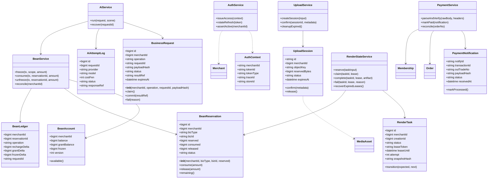
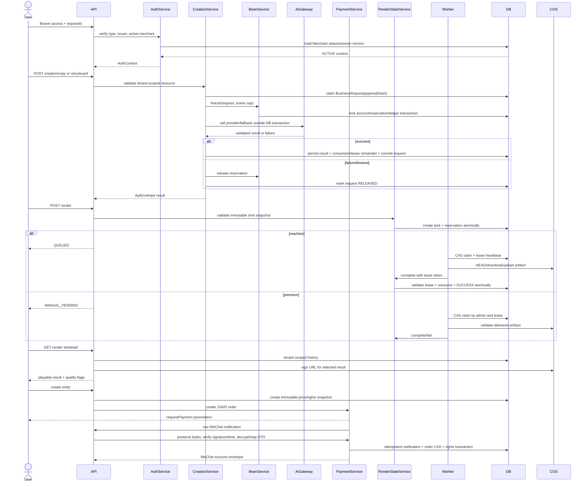
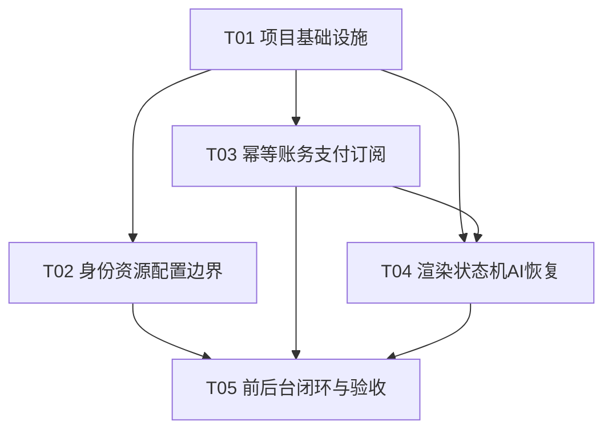

# 大帅餐饮小程序：整改系统设计

> 本设计服务于 `docs/审计-架构与业务逻辑.md` 的工程整改，不改变当前技术栈，不代表代码已经实现。目标是用最少的新抽象修复租户边界、账务幂等、支付回调、异步任务和前后台结果闭环。

## 1. Implementation Approach

### 1.1 Core challenges

1. 认证上下文必须同时隔离 token 类型、商家状态、门店/资源归属和请求幂等作用域。
2. 积分是资金等价物：冻结、混合分桶扣减、差额释放、失败退款及并发结算必须由同一业务预留模型约束。
3. 微信回调必须保留原始字节、验签、解密、字段映射、金额/商户校验和通知幂等。
4. FFmpeg/TTS/COS 是外部副作用，任务状态不能依赖进程内变量；worker 崩溃要可恢复，成功/失败与账务终态要互斥。
5. AI 日志是调用尝试，不是业务结果；必须把可恢复结果与扣费终态绑定。

### 1.2 Stack and patterns

- Node.js 20+ / TypeScript：沿用服务端，避免迁移成本。
- Express 4：沿用路由，但所有异步handler统一 `asyncHandler`，支付路由在 JSON parser 前挂载 raw body。
- Prisma + MySQL 8 / InnoDB：保存 `BusinessRequest`、`BeanReservation`、`PaymentNotification`、任务租约；账户与请求按固定锁顺序更新。
- Redis/ioredis：仅作缓存、分布式配置失效和可选租约协调；账务真相在 MySQL。
- Zod：认证载荷、支付通知、后台设置和外部元数据运行时解析。
- COS SDK：STS 为单次上传会话发不可覆盖对象 key；服务端 HEAD/ffprobe 确认真实元数据。
- FFmpeg/ffprobe：worker 中执行，任务级 deadline、心跳、attempt/fencing token。
- Taro/React/Zustand：小程序继续使用，改成单一 `AccountSnapshot` 和历史结果恢复；后台继续 TDesign，服务端执行 RBAC。
- Architecture pattern: 模块化分层（routes → application services → repositories/domain services → Prisma）；账务使用 Reservation + Ledger；异步使用 DB 状态机 + outbox/补偿；外部调用采用 adapter/gateway。

### 1.3 Transaction rules

- 任何账务变更都在 TransactionClient 中完成；禁止在可选事务内混用全局 Prisma。
- 推荐锁顺序：`Merchant/BeanAccount → BusinessRequest/Reservation → Creation/RenderTask → Ledger`。所有模块遵守同一顺序。
- 账户更新、预留更新、流水写入、请求状态写入必须在同一事务；外部 COS/微信/AI 调用不持有数据库长事务，调用完成后通过状态和补偿提交。
- 所有重复请求先按 tenant + operation + requestId 找请求；payload hash 不同返回冲突 409，不复用结果。

## 2. File List

### Existing files to modify

- `server/src/env.ts`
- `server/src/index.ts`
- `server/src/middleware/auth.ts`
- `server/src/middleware/admin-auth.ts`
- `server/src/lib/jwt.ts`
- `server/src/lib/errors.ts`
- `server/src/lib/settings.ts`
- `server/src/lib/wxpay.ts`
- `server/src/routes/pay.ts`
- `server/src/routes/creations.ts`
- `server/src/routes/admin.ts`
- `server/src/auth/auth.service.ts`
- `server/src/auth/sms.ts`
- `server/src/services/creation.service.ts`
- `server/src/services/upload.service.ts`
- `server/src/services/order.service.ts`
- `server/src/services/subscription.service.ts`
- `server/src/bean/bean.service.ts`
- `server/src/ai/ai.service.ts`
- `server/src/ai/gateway.ts`
- `server/src/services/render.service.ts`
- `server/src/render/worker.ts`
- `server/src/render/premium.ts`
- `server/src/render/tts.ts`
- `server/src/render/synthesis.ts`
- `server/prisma/schema.prisma`
- `server/prisma/migrations/*/migration.sql`
- `apps/mini/src/store/merchant.ts`
- `apps/mini/src/services/request.ts`
- `apps/mini/src/pages/render/compose.tsx`
- `apps/mini/src/pages/recharge/index.tsx`
- `apps/admin/src/pages/RenderTasks.tsx`
- `apps/admin/src/lib/http.ts`

### New files

- `server/src/lib/config.ts`: production startup validation.
- `server/src/lib/async-handler.ts`: Express 4 Promise error bridge.
- `server/src/domain/request.ts`: request scope and payload hashing.
- `server/src/domain/reservation.ts`: freeze/consume/release invariants.
- `server/src/services/payment-notify.service.ts`: raw notification validation and idempotency.
- `server/src/services/render-state.service.ts`: CAS transitions and settlement compensation.
- `server/src/jobs/recovery.ts`: expired lease, frozen reservation, payment reconciliation.
- `server/src/observability/logger.ts`: structured logger and trace context.
- `server/test/auth-tenant.test.ts`
- `server/test/bean-concurrency.test.ts`
- `server/test/payment-notify.test.ts`
- `server/test/render-recovery.test.ts`
- `server/test/upload-quota.test.ts`
- `server/test/api-contract.test.ts`

## 3. Data Structures and Interfaces



### Core interfaces

```ts
export type ApiEnvelope<T> = {
  code: number
  message: string
  data: T | null
  traceId: string
}

export type RequestScope = {
  merchantId: bigint
  operation: string
  requestId: string
  payloadHash: string
  resourceId?: bigint
}

export type AccountSnapshot = {
  available: string
  rechargeBalance: string
  grantBalance: string
  frozen: string
  asOf: string
}

export type PaymentNotify = {
  notifyId: string
  appid: string
  mchid: string
  outTradeNo: string
  transactionId: string
  tradeState: 'SUCCESS' | 'NOTPAY' | 'CLOSED' | string
  amountFen: number
  rawPayloadHash: string
}

export type Artifact = {
  resultKey: string
  previewKey?: string | null
  resultSize: bigint
  durationMs: number
  qualityFlags: string[]
}
```

## 4. Program Call Flow



### CRUD and initialization

- Bootstrap validates environment, connects MySQL/Redis, registers raw pay route before JSON parser, then starts API. Worker and recovery jobs are separate production processes.
- Merchant login creates/loads merchant, default store, bean account and session in one transaction; registration grant uses deterministic request ID.
- Store/Dish/Creation CRUD always uses `(merchantId, id, deletedAt)` scope. Dish belongs to requested store before Creation insert.
- Upload creates a session and quota reservation; confirmation HEADs the exact object and creates `MediaAsset` only once.
- Render GET always checks merchant ownership, returns immutable task snapshot and signs only allow-listed object prefixes.
- Order GET is merchant scoped; payment notification uses `notifyId` and `transactionId` idempotency.

## 5. Anything UNCLEAR

- Product must decide whether subscription grants expire by lot, by current membership end, or via a carry-forward policy; Reservation must remain independent of that choice.
- Product must define cash refund policy separately from failed render/AI bean release, plus late payment after order close.
- The audit cannot infer production environment values, deployment topology, Prisma version, MySQL isolation level, or WeChat platform certificate rotation policy.
- Existing `Creation.status` and `Shot.status` may be redundant projections; implementation should designate one source of truth before adding transitions.
- TTS provider and CJK font requirements are product release gates. If unavailable, AI grade must be disabled or explicitly labeled as degraded rather than silently successful.
- Employee/role-level store permissions are not present in the current product model. If needed, add MerchantUser/StoreMember relations rather than treating `X-Store-Id` as authorization.

## 6. Required Packages

- `express@^4.21.0`: HTTP routing and middleware
- `zod@^3.23.0`: runtime input and notification validation
- `jsonwebtoken@^9.0.0`: typed JWT issue/verify with explicit claims
- `@prisma/client@^5.0.0`: MySQL data access and transactions
- `ioredis@^5.4.0`: cache and distributed invalidation
- `qcloud-cos-sts@^3.1.0`: least-privilege COS STS credentials
- `cos-nodejs-sdk-v5@^2.14.0`: object HEAD/sign/upload operations
- `pino@^9.0.0`: structured logs
- `@opentelemetry/api@^1.9.0`: optional trace context propagation
- `vitest@^2.0.0`: unit and integration tests
- `testcontainers@^10.0.0`: MySQL/Redis integration tests
- `taro@^3.6.0`: existing miniapp framework
- `react@^18.2.0`: existing miniapp/admin UI framework
- `zustand@^4.5.0`: existing miniapp state
- `tdesign-react@~1.9.0`: existing admin component library
- `tdesign-icons-react@~0.3.0`: existing admin icons
- `react-router-dom@^6.26.0`: existing admin routing
- `axios@^1.7.7`: existing admin HTTP client

## 7. Task List (ordered by dependency)

### T01: 项目基础设施

- **Source Files**: `server/package.json`, root `package.json`, `server/.env.example`, `server/src/env.ts`, `server/src/index.ts`, test scripts and CI entry.
- **Dependencies**: none
- **Priority**: P0
- **Acceptance**: production config validation fails closed; pay raw route order is explicit; typecheck/build/test commands reproducible.

### T02: 身份、资源与配置边界

- **Source Files**: `server/src/middleware/auth.ts`, `server/src/lib/jwt.ts`, `server/src/auth/auth.service.ts`, `server/src/services/creation.service.ts`, `server/src/services/upload.service.ts`, `server/src/routes/admin.ts`, `server/src/lib/settings.ts`.
- **Dependencies**: T01
- **Priority**: P0
- **Acceptance**: token type/status/session checks, tenant-scoped resource joins, upload sessions and bounded settings, RBAC/audit hooks.

### T03: 业务幂等、账务与支付订阅

- **Source Files**: `server/prisma/schema.prisma`, `server/prisma/migrations/*/migration.sql`, `server/src/domain/request.ts`, `server/src/domain/reservation.ts`, `server/src/bean/bean.service.ts`, `server/src/services/order.service.ts`, `server/src/lib/wxpay.ts`, `server/src/routes/pay.ts`, `server/src/ai/ai.service.ts`.
- **Dependencies**: T01
- **Priority**: P0
- **Acceptance**: no negative buckets, tenant/request hash scoped idempotency, raw WeChat verification and amount checks, one order one entitlement, reconciliation jobs.

### T04: 渲染状态机、AI结果与恢复

- **Source Files**: `server/src/services/render.service.ts`, `server/src/services/render-state.service.ts`, `server/src/render/worker.ts`, `server/src/render/premium.ts`, `server/src/render/tts.ts`, `server/src/render/synthesis.ts`, `server/src/ai/gateway.ts`, `server/src/jobs/recovery.ts`.
- **Dependencies**: T01, T03
- **Priority**: P0
- **Acceptance**: task+reservation atomic creation, lease/fencing/retry/recovery, CAS terminal states, real TTS/font validation, settlement compensation.

### T05: 前后台契约、结果闭环与独立验收

- **Source Files**: `apps/mini/src/store/merchant.ts`, `apps/mini/src/services/request.ts`, `apps/mini/src/pages/render/compose.tsx`, `apps/mini/src/pages/recharge/index.tsx`, `apps/admin/src/pages/RenderTasks.tsx`, `apps/admin/src/lib/http.ts`, all `server/test/*.test.ts`.
- **Dependencies**: T02, T03, T04
- **Priority**: P0
- **Acceptance**: unified account snapshot/error envelope; historical play/download recovery; delayed payment UX; QA evidence for concurrency, tenant, payment, COS, FFmpeg/TTS and production config.

## 8. Shared Knowledge

- All API responses use `{ code, message, data, traceId }`; payment callback response follows WeChat's callback contract separately.
- All dates are ISO 8601 UTC; database timestamps remain UTC.
- Merchant is tenant; every read/write of merchant-owned resources requires merchant scope. `X-Store-Id` is context only.
- Money is integer fen; points are bigint strings over JSON. Never use JavaScript floating point for balances.
- A failed AI/render task releases its bean reservation; a bean release is not a cash refund.
- Idempotency scope is `(merchantId, operation, requestId, payloadHash)`. Same key with different payload returns conflict.
- Only committed business results can be returned on replay. Provider attempt logs cannot stand in for business completion.
- Production never infers demo behavior from missing credentials. Demo mode is explicit, isolated, and non-financial.
- Worker/sweeper are horizontally deployed jobs. In-process booleans are not distributed locks.
- Logs must carry `traceId`, `merchantId`, `requestId`, `taskId`, `orderNo`; secrets, phone verification codes and prompt content require masking/retention policy.

## 9. Task Dependency Graph


