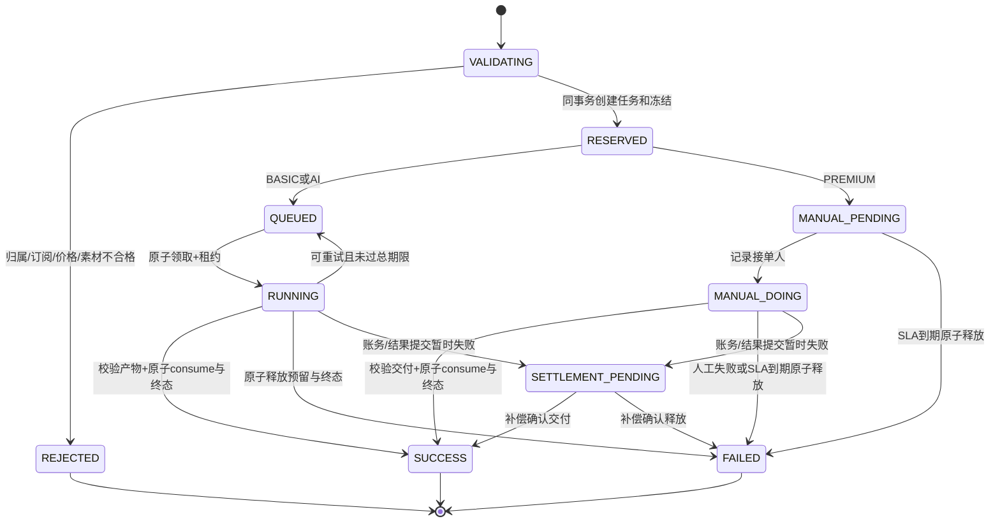
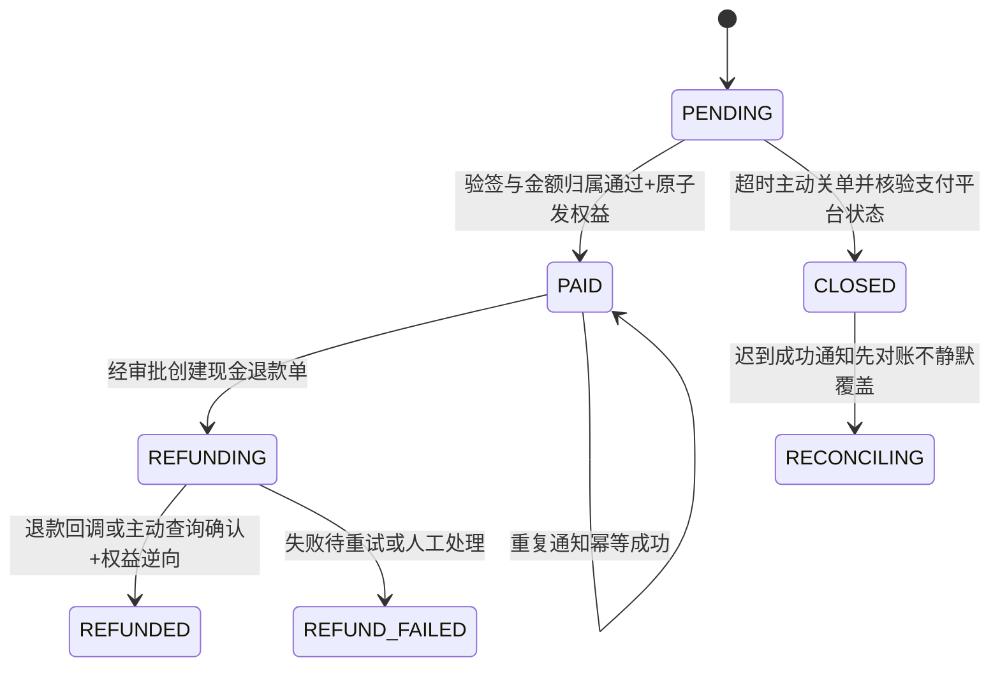
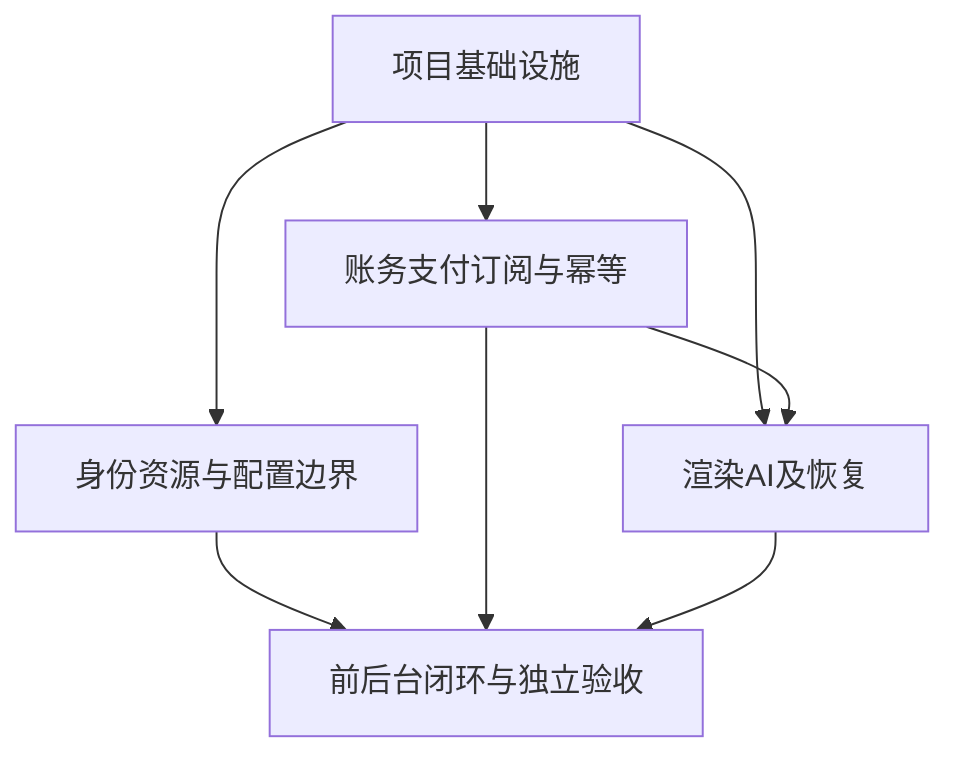

# 大帅餐饮小程序：架构与业务逻辑审计

> 审计角色：Bob / 软件架构师。范围：`server`、`apps/mini`、`apps/admin`，以上游 `docs/审计-产品体验.md` 为产品输入，现有源码为实现事实。仅新增审计材料，未修改业务代码。
>
> 证据等级：**S=静态源码已确认**；**C=源码存在竞态/缺口，具体结果需并发或故障注入确认**；**E=真实环境待验收**。本文不是已执行测试结果。未运行数据库迁移、真实微信支付、COS/TTS/FFmpeg 联调、构建或真机测试；没有生产配置、监控或历史事故数据。行号针对审计时工作区快照，修复后需重新定位。

## 1. 结论与发布建议

**不建议按当前实现开放真实付费生产流量。** 主要阻断项不是技术栈选择，而是认证/租户边界、积分不变量、支付回调协议和任务结算原子性。已有 Express 路由—服务—Prisma 分层、账户行锁、流水唯一约束、worker 条件抢占等正确基础；不能因此推导全部幂等、退款和隔离已正确。

- P0 共 **11** 项：身份与默认配置、跨租户资源/幂等键、积分混扣/冻结、支付旁路/回调、任务资金状态、AI 成片承诺。
- P1 共 **12** 项：上传、异步恢复、订阅/到期、AI持久化、分镜版本、前端结果/账务、错误契约、配置与管理权限、预算。
- P2 共 **3** 项：性能索引、可观测性与长期治理。
- 验收闭环：修复人提供变更 → QA 独立执行复现用例 → 校验 DB/流水/COS 实物及页面 → 证据归档。源码推断不应记作“测试通过”。

### 1.1 当前系统轮廓

| 层 | 当前实现 | 评价 |
|---|---|---|
| 小程序 | Taro/React、Zustand、统一 request 封装 | 已有刷新 token 合并请求，但账户字段语义不稳定、结果恢复缺失 |
| 管理后台 | React/Vite、TDesign、localStorage token | 单角色全权限，精品交付仍手工填写 COS key |
| API | Node.js/TypeScript、Express 4、Zod | 领域服务较清晰，部分 async 路由绕过错误中间件 |
| 数据 | Prisma + MySQL；Redis 缓存 | 金额/积分使用整数良好；关键原子边界和业务唯一键不足 |
| AI | 场景→模型/供应商→fallback→调用日志 | 有预算/熔断雏形，没有完整业务请求状态与补偿 |
| 视频 | DB 队列 + FFmpeg worker + COS；人工精品 sweeper | 抢占用条件更新正确，但无租约/崩溃恢复，退款与终态分离 |
| 支付 | 手写 JSAPI/RSA/AES-GCM | 原始 body 顺序和通知字段映射均有确定性缺陷 |

**门店边界说明：** 当前 Merchant 是租户/付费主体，Store 是其下业务归属，不存在员工门店权限模型。小程序 `X-Store-Id` 是界面上下文，不可当作授权凭证。本文“跨门店”首先指数据关系错误；若产品要不同员工只能访问部分门店，需要独立设计成员—门店权限关系，不能仅依靠切换器。

## 2. P0：上线阻断

### ARC-P0-01：refresh token 可被当作业务 access token；禁用商家未完整阻断

- **证据（S）**：`server/src/middleware/auth.ts:16-29` 仅 `verifyToken` 后读 `mid`；`server/src/lib/jwt.ts:8-16,25-42` access 无类型、refresh 含相同 mid 且有效 30 天；`server/src/auth/auth.service.ts:101-107` 只有 refresh 显式检查 ACTIVE，微信/短信登录的 `upsertMerchantByPhone:132-146` 和签发 `158-167` 不校验状态。
- **问题/影响**：长效 refresh 可直接调用业务；后台禁用商家后旧令牌仍可执行付费/资源操作，且其他登录路径可能继续签发令牌。不是“管理员 token 能直接作为商家 token”：admin 无 mid，当前 BigInt 转换通常会拒绝它。
- **验证**：隔离环境商家A正常登录，分别用 access/refresh 调 `/api/v1/account` 对应账户接口；后者应401。将A禁用，重复业务请求、刷新、微信/短信登录，全部应拒绝；保留 HTTP 和商家状态证据。
- **建议**：access/refresh/admin 强制 `typ`、issuer/audience、算法白名单和载荷校验；所有发证/鉴权检查 ACTIVE；会话版本/撤销、refresh rotation 与重放检测。不要只在前端隐藏禁用功能。
- **依赖**：ARC-P0-02；验收覆盖登录、刷新、业务三条路径。

### ARC-P0-02：开发登录、默认密钥和默认管理员没有生产硬闸

- **证据（S/E）**：`server/src/lib/jwt.ts:6` 缺失密钥使用公开默认值；`server/src/auth/auth.service.ts:115-123` 只看 DEV_LOGIN，无 NODE_ENV 二次限制；`server/src/routes/auth.ts:62-67` 暴露开发能力；`server/.env.example:14,18,28,33,42` 示例含 dev JWT、DEV_LOGIN=true、固定主密钥、模拟 worker、弱管理员密码；`server/prisma/seed.ts:14-19,376-378` 回退 dev 主密钥/管理员弱口令。`docker-compose.yml:19,40` 弱 MySQL root 密码与直接暴露 Redis 端口。
- **问题/影响**：误复制示例即可使按手机号无验证登录成为账号接管入口；已知 JWT secret 可伪造商家/管理员令牌。不能据源码断言生产已这样部署。运行时 `lib/secret.ts` 本身缺失主密钥会报错，问题是 seed 和示例允许固定值，不是所有场景都默认解密成功。
- **验证**：用生产模式启动、分别删除必需配置/保留示例值/开启 DEV_LOGIN，期望启动失败；不要在生产尝试账号接管。审查部署清单和 secret manager，不在报告复制真实密钥。
- **建议**：建立按部署角色校验的 ConfigSchema；生产拒绝 dev login、mock provider、模拟支付/成片、已知示例密钥；seed 分成安全基础配置与仅开发演示数据；管理员强口令/MFA、密钥轮换、Redis认证及私网监听。
- **依赖**：无；是全部生产验收前置。

### ARC-P0-03：创作可引用其他租户菜品/素材，渲染链路读取其 COS key

- **证据（S）**：`server/src/services/creation.service.ts:77-90` 只验 store 不验 dish；`:93-106,119-139` 关联读菜品和素材；`:251-267` 验 creation/shot，但 assetId 直接写。`server/src/services/render.service.ts:219-242` 根据资产ID查询无 merchant/store 条件并写 cosKey 到 clips；`server/prisma/schema.prisma:165-168` Shot 只关联 creation，assetId 无资产关系。
- **问题/影响**：A可将B的 dishId/assetId绑定自己的创作/分镜，菜品内容进入 AI 上下文、视频进入A合成。asset ID可被获得或猜测时具有可利用路径；不需要窃取B token。存在外键只能证明ID存在，不能证明同租户/同门店。
- **验证**：准备A/B两个租户和各自门店菜品素材；以A token创建A门店+B菜品，或 PUT A分镜+B素材；期待404/403且DB无变更。当前路径应继续跟到 task.paramsJson.clips 和受控样本成片，验证真实泄漏面。
- **建议**：关系写入时统一检查 `(id,merchantId,storeId,deletedAt/status)`；渲染二次验证全部资产；允许跨门店复用时必须有明确授权策略；补资产外键和复合一致性约束/服务断言。
- **依赖**：ARC-P0-01；ARC-P1-01 的真实对象校验不能替代租户校验。

### ARC-P0-04：幂等键缺少租户与操作作用域，AI 重放可能返回他人内容

- **证据（S）**：`server/src/bean/bean.service.ts:93-95,113-115` 查流水仅 requestId/type；`server/prisma/schema.prisma:263-266` 全局唯一；`server/src/ai/ai.service.ts:77-89` 重复后 `aiCallLog.findFirst({requestId})` 直接返回 responseSnapshot，不校验 merchant/scene/bizId；`server/src/routes/creations.ts:60-82` 接收用户 requestId。
- **问题/影响**：不同商家使用同一已存在键会共享“重复”判断并可能取到另一商家的 AI 文案。同商家跨创作/场景复用键也可返回错误业务结果。随机 UUID 只能降低偶然碰撞，不能替代权限边界。
- **验证**：A以固定键K完成文案，B对自己的合法创作用K生成（两者均有订阅）；检查B响应是否含A文本且未冻结。再同商家K跨创作/分镜调用，期待409参数冲突而非复用错结果。
- **建议**：独立 BusinessRequest，唯一 `(merchantId,operation,requestId)`，保存资源ID、canonical payload hash和终态结果；所有重复查询按作用域与参数签名比较；流水引用内部业务请求ID，AI尝试日志与业务最终结果分表。对存量历史键制定迁移方案。
- **依赖**：ARC-P0-03；需同时修改 schema、账务与AI入口，不能只给日志查询加 merchantId。

### ARC-P0-05：赠送积分不足时整笔扣充值积分，可产生负余额

- **证据（S）**：`server/src/bean/bean.service.ts:180-198` 只校验账户总冻结，`:185-187` 在“全赠送/全充值”二选一；账户 balance/grantBalance 为有符号BigInt：`schema.prisma:231-233`。
- **问题/影响**：充值40、赠送60、冻结80时，consume80会得到充值-40、赠送60；违背“赠送优先，不足用充值”和分桶非负不变量。总可用看似正确不代表账务正确；后续赠送到期可进一步放大争议。
- **验证**：账户40/60/0→freeze80→consume80，应为20/0/0，而当前算法为-40/60/0。补0赠送、恰好够、全赠送、多个并发消费、到期并发矩阵。
- **建议**：`grantUsed=min(grantBalance,amount); rechargeUsed=amount-grantUsed`，并验证充值余额足够；流水记录双桶delta或一笔结算+两个明细，不能继续单一bucket丢失分摊；增加不变量断言/定时对账。
- **依赖**：与ARC-P0-06一起重构；迁移前识别和修复负余额历史账。

### ARC-P0-06：freeze 吞唯一键异常且未回滚先前账户更新；冻结未按业务绑定

- **证据（S/C）**：`server/src/bean/bean.service.ts:113-146` 查重在加锁前、先更新账户 frozen，再写流水，捕获P2002直接正常返回；`:181-188` consume只看账户总冻结；`:225-243` unfreeze按账户总冻结静默截断。`FREEZE.amount=0`，预留额主要记录在备注和全账户快照。
- **问题/影响**：同requestId并发若均先查无记录，第二事务在账户锁后仍先增冻结；唯一冲突被吞，MySQL可能提交账户变更但无第二流水。需以实际 Prisma/MySQL事务行为实测，不能当作已复现。更确定的是 consume/unfreeze没有校验业务请求剩余冻结，失败/迟到成功可能释放或消费其他任务预留。
- **验证**：MySQL真实事务，用屏障令两调用均过查重后再竞争同一账户、同一键，充足余额下重复100次；成功返回后检查 frozen是否恰为单份、FREEZE是否一条、账户与流水快照相符。另任务A已释放但B仍冻结时，对A重复consume/unfreeze，必须拒绝且B冻结不变。
- **建议**：账户锁后再次以正确作用域查重；任何变更后P2002让整个事务回滚，再在事务外读取首次结果。新增 Reservation(id,merchantId,bizId,reserved,consumed,released,status)，consume+release不得超出该预留；所有账务写方法只接受 TransactionClient，避免传全Prisma时锁自动提交失效。
- **依赖**：ARC-P0-04、05；ARC-P0-10的结算互斥依赖本项。

### ARC-P0-07：支付配置缺失自动视为已付款并发放权益

- **证据（S/E）**：`server/src/lib/wxpay.ts:9-18` 缺任一关键参数 wxpayEnabled=false；`server/src/services/order.service.ts:128-132,178-180` 即 `markOrderPaid(...DEV...,true)`，不是拒绝支付。
- **问题/影响**：生产漏配凭据变成免费订阅/加油包。NODE_ENV不参与判断。此处是可确认的配置失败开放行为，不是断言实际发生损失。
- **验证**：隔离库 NODE_ENV=production、移除任一支付凭据，对订阅下单；期望启动/下单失败且无PAID/赠送流水，当前分支会发权益。需要验证加油包时先准备有效订阅。
- **建议**：显式 paymentMode，生产仅REAL且全量配置自检；演示支付使用隔离数据、不可复用真实order结算入口；禁止通过“缺凭据”隐式选择模拟模式。
- **依赖**：ARC-P0-02；上线前查询 DEV交易号并清理/复核演示权益。

### ARC-P0-08：微信支付回调双重断链——原文被JSON解析，字段命名未映射

- **证据（S）**：`server/src/index.ts:39` express.json先于`:45` raw；`server/src/routes/pay.ts:14-20` 假定body为Buffer并toString；`server/src/lib/wxpay.ts:85-102` 解密JSON直接强转camelCase接口；`server/src/services/order.service.ts:273-281` 使用tradeState/outTradeNo/transactionId。
- **问题/影响**：application/json进入全局parser后为对象，toString通常得到`[object Object]`，签名原文丢失。即使修复顺序，标准通知字段trade_state/out_trade_no/transaction_id不自动改名，成功通知分支不执行却返回SUCCESS，形成“实际已付，本地未入账”。类型断言不是运行时转换。
- **验证**：两项必须独立测。A保留空格/换行的受控签名通知经完整Express HTTP入口检查raw bytes及验签；B以测试APIv3 key构造标准snake_case密文直接调用decryptResource/handleNotify，检查订单从PENDING转PAID及权益。修好A但B仍失败不可验收。
- **建议**：pay raw router先于json挂载，或verify回调保存原始Buffer；通知DTO用Zod按真实字段解析并显式映射。成功/失败HTTP响应遵循支付专用协议，不套一般业务信封（当前`pay.ts:21-24`需真实联调确认，不单凭嵌套JSON认定微信一定拒收）。
- **依赖**：ARC-P0-07；联调需具备有效支付平台验签材料。

### ARC-P0-09：支付通知缺少业务验真与完整幂等状态门禁

- **证据（S/C）**：`wxpay.ts:85-89` DTO不含appid/mchid/amount；`:106-117` 仅签名无时间窗口/证书序列号选择；`order.service.ts:197-220` 事务外读PAID、事务内按orderNo无条件更新；`:201-205` 按回调时当前配置取订阅权益，非下单快照；`:239-268` 续期未先锁商家。`schema.prisma:347` 已有wxTransactionId唯一约束，账务也有业务键唯一约束。
- **问题/影响**：无法防止有效签名但应用/商户/金额不匹配的错误通知；迟到/关闭状态未定义；重复回调依赖下游唯一异常兜底，可能返回失败触发重试。**不能仅据先读后写断言同一订单一定重复入账**：现有流水唯一约束在事务内会使重复结算回滚。但两个不同有效订单并发续订，仍有丢失续期或多个ACTIVE会员风险。
- **验证**：错appid/mchid/amount/currency、过期通知时间、同transactionId对应另一订单均不入账；同一通知并发20次最终一笔权益且全部返回幂等成功；不同两订单同商家并发支付，应连续延长两周期且唯一当前订阅。下单后改赠送/天数，再回调，订单应按购买时承诺交付。
- **建议**：校验标准DTO全字段与订单快照；通知ID/支付流水持久化，时间窗与平台验签材料轮换；锁订单并执行合法状态CAS，重复终态直接返回成功；按merchant锁串行续期；明确关闭、取消、退款与主动查单补偿。实收退款须有独立退款单/回调/账务逆向，不能把unfreeze叫微信退款。
- **依赖**：ARC-P0-08、ARC-P0-06、ARC-P1-03。

### ARC-P0-10：任务创建、预留、成功/失败资金终态不是原子状态机

- **证据（S/C）**：`render.service.ts:275-307` 建任务事务先提交再另事务freeze；`:339-350` 仅积分不足标FAILED（且更新失败被吞），其他异常留可执行任务；`:371-394` completeRender不核验当前状态。`premium.ts:63-76` 状态检查在事务外；`:81-110,159-191` 退款与FAILED分开；`worker.ts:226-249` 退款异常记录后仍尝试FAILED。
- **问题/影响**：worker可能在freeze提交前读到QUEUED；进程崩溃留无预留任务；交付与超时/人工失败竞争，已成功任务可被改FAILED或释放其他冻结；worker退款失败却终态失败，用户以为“全额退款”但余额未恢复。
- **验证**：①暂停在任务创建提交与freeze间，触发worker；②冻结前DB故障/杀进程；③精品交付与sweeper、人工失败并发（另有同商家其他冻结任务）；④让unfreeze失败。每轮查任务status、resultKey、预留和CONSUME/UNFREEZE，不只查接口。期望终态与账务唯一对应且无他单影响。
- **建议**：锁creation/merchant按固定顺序，在同事务建任务+业务预留；只有预留成功任务可见为QUEUED。成功/失败/超时在锁task或version CAS的同一事务中结算并写终态；外部上传成功后用outbox/结果候选记录提交；退款失败进SETTLEMENT_PENDING并补偿，不假称退款成功。
- **依赖**：ARC-P0-04、05、06；为机器与人工共用终态服务，避免分别修补。

### ARC-P0-11：付费AI档没有真实配音，且任务快照遗漏口播导致字幕链路也断开

- **证据（S/E）**：`server/src/render/tts.ts:34-53` 真实provider分支未实现并退静音；`render.service.ts:230-242` clips构造遗漏`s.line`，尽管接口`:73-74`定义line；`worker.ts:163-179` 把clip.line传给synthesis；`synthesis.ts:36-49,96-125` 空line不生成SRT、静音轨替换原音轨。`premium.ts:125-127` 人工素材单line同样取任务快照。`render.service.ts:314-335` FFMPEG_WORKER不为true直接扣费SUCCESS，resultKey为首素材而非合成产物。
- **问题/影响**：AI比基础档贵但可能得到无配音无字幕的视频；不仅“供应商配置缺失”，即使配置好也无实现。模拟模式按多段时长扣费却交首段素材。按真实付费上线标准列P0；若彻底关闭AI/演示付费入口，可将TTS实施本身移至后续。
- **验证**：两分镜不同可识别口播与画面，查看paramsJson.clips.line、实际声波/听感和画面字幕；模拟与真实各测；不能以“有AAC音轨”“status=SUCCESS”视为AI成功。精品素材清单应含口播。
- **建议**：快照line/脚本版本；接入可用TTS并做真实合成健康探测；固定带CJK字体/libass的容器镜像，检查字体文件而非仅目录；结果记录qualityFlags/降级原因并按承诺拒绝/降价/退款；生产禁止模拟成功。
- **依赖**：ARC-P0-02、10；与产品报告TTS风险合并验收。

## 3. P1：可靠性、商业闭环和维护性

### ARC-P1-01：上传确认信任客户端元数据，配额无原子预占

- **证据（S/C/E）**：`upload.service.ts:45-82` STS按商家宽前缀授权；`:128-155` 仅校验前缀/门店后按客户端sizeBytes配额并READY入库，不HEAD对象/ffprobe；`render.service.ts:191-198,253-269` 直接用durationMs计费。
- **影响**：虚报大小绕配额/虚报时长少收费；不存在对象也READY；并发确认超额；拿到STS后即使配额耗尽也可写未登记对象，失败上传/分片残留不入已用空间；相同key可覆盖导致缓存与素材不一致。COS的`..`通常是对象key字符，**本文不宣称前缀检查已存在文件系统目录穿越**。
- **验证**：1秒元数据对应60秒实物、小size对应大文件、不存在key、重复confirm、只剩100MB时两次80MB并发、STS在配额耗尽后PUT和覆盖原key；核对COS实物/DB/计价差异。
- **建议**：创建UploadSession并原子预占配额，STS只授本次随机不可覆盖key；确认HEAD大小/类型/ETag、异步ffprobe+内容审核后READY；按merchant锁确认并幂等；过期预留与孤儿对象/分片清理。裁剪区间须0≤start<end≤真实时长。
- **依赖**：ARC-P0-03、ARC-P0-10；增加成本安全限额。

### ARC-P1-02：worker/AI 缺少租约、总超时与崩溃补偿

- **证据（S/C）**：`worker.ts:60-81` 只选QUEUED并改RUNNING；`:28-29,127-132,145-179` 超时逐FFmpeg调用，无任务总deadline；`schema.prisma:205` retryCount未见worker推进。`ai.service.ts:59-100` freeze提交后调用外部服务；进程异常无持久化执行租约。`index.ts:91-109` API同进程启动worker和sweeper。
- **影响**：RUNNING崩溃后不再被领取，AI长期冻结；每段都用完整超时、下载上传无总deadline，多段任务可无限拉长；多实例sweeper可重叠扫描（进程布尔不是分布式锁）。
- **验证**：RUNNING/AI冻结后kill进程并重启，超过租约应恢复或释放；下载挂起、超长素材、多个实例启动，观察任务终态/冻结和重试次数。
- **建议**：workerId、leaseUntil、heartbeat、attempt/fencingToken、maxAttempts、总deadline；按重试类别有限退避；过期租约重入队/终止；外部产物幂等key；终态补偿走ARC-P0-10统一服务。API和CPU worker独立资源配额。
- **依赖**：ARC-P0-06、10。

### ARC-P1-03：赠送积分到期未见调度，续期与权益快照不完整

- **证据（S/C）**：`bean.service.ts:305-324` 有expireGrant但`server/src`调用搜索仅定义；它直接清grantBalance且不处理冻结；`order.service.ts:239-268` 同一会员grantBeans累加、grantExpireAt延长；`schema.prisma:307-324` 无周期赠送明细/来源订单唯一约束；`order.service.ts:201-205` 回调读配置。
- **影响**：产品“赠送到期清零”缺自动执行；若直接上线现有expireGrant，可能清掉冻结所需赠送造成可用负值/结算混乱。续订是否延长全部赠送还是按批次失效尚需产品拍板，不能自行假定批次规则。多订单并发续期风险见P0-09。
- **验证**：到期前冻结/到期后完成；老周期剩余+新周期赠送；时区临界；跨实例续期；对比权益承诺与到期后账户。确认调度确实存在并有监控，而非只看到函数。
- **建议**：产品先确定续期/冻结到期策略；建立GrantLot和Reservation分配或明确单周期汇总规则；幂等到期作业、账务对账、购买时价格/天数/赠送/配置版本快照。
- **依赖**：ARC-P0-05、06、09；产品版本收敛。

### ARC-P1-04：AI尝试日志被当作业务完成记录，业务持久化失败后仍可能已扣费

- **证据（S/C）**：`ai.service.ts:77-89` 任意findFirst日志视为完成、固定isFallbackTemplate=false；`:95-100` 网关调用无外层try/finally兜底；`:165-168` 按requestId updateMany所有尝试日志；`ai/gateway.ts:121-141` 先写网关日志；`creation.service.ts:153-161,194-235` AI结算后才更新创作/分镜。
- **影响**：网关已有日志但账务未settled，重试误返回成功；fallback多尝试可能选中失败/空记录；业务写入失败产生“扣费但结果未保存”；responseSnapshot截断8000字符，重放结果与首次全文不同。
- **验证**：网关日志成功后冻结结算故障；结算成功后creation.update失败；主模型失败备用成功后原键重试；超过8000字/JSON分镜响应，比较首次与重放。
- **建议**：区分BusinessRequest终态和AiAttemptLog；完整最终结果可恢复存储；业务结果持久化与结算形成原子完成，外部调用用outbox/补偿；所有异常归类和冻结回收；重复请求只返回已COMMITTED结果。
- **依赖**：ARC-P0-04、06，ARC-P1-02。

### ARC-P1-05：分镜重生成破坏旧素材绑定且缺少版本/结构校验

- **证据（S/C）**：`creation.service.ts:205-238` JSON解析得到非数组/非shots对象会使用空数组，事务deleteMany旧shot后parsed=true；只做字段类型强转，无完整Zod约束；`:251-267` 绑定素材不更新Shot.status。`schema.prisma:190-225` RenderTask独立状态，相关服务未同步Creation状态。
- **影响**：合法JSON但错误结构可删除全部旧分镜；同requestId重放仍删除重建shots、丢上传绑定；并发重新生成导致后到覆盖；创作/分镜status长期停默认，不能可靠表示流程。事务内部创建失败通常会回滚delete，**不是任意异常都一定丢旧数据**。
- **验证**：已有素材分镜，AI返回`{}`、`[]`、越界字段；原键重试；两个请求逆序完成；合成处理中重新生成；断言旧版本保留、invalid output不收费/不覆盖、已绑定素材可追溯。
- **建议**：生成候选版本，严格非空结构/镜头上限/时长校验；用户确认替换，version CAS；渲染引用不可变shot/script快照；业务状态统一投影或删除冗余状态字段。
- **依赖**：ARC-P1-04、ARC-P0-10。

### ARC-P1-06：小程序余额字段混用，影响预估/拦截/信任

- **证据（S）**：`apps/mini/src/store/merchant.ts:71-80,89-105` balance在登录/refreshBean为充值余额、refreshMe为available；`apps/mini/src/pages/home/index.tsx:90-95` 加grantBalance；`apps/mini/src/pages/render/compose.tsx:123-133` 只比balance。
- **影响**：充值40赠送60冻结20，真实available80；refreshBean后合成只见40，refreshMe后首页可能显示140。先调用哪个接口会改变同字段含义；客户端拦截不能保证服务端资金安全。
- **验证**：固定上述快照，按登录→首页→我的→合成和反向导航，比较首页、充值、合成、流水数值；冻结/支付/退款后网络失败/重入页。
- **建议**：一个AccountSnapshot保留recharge/grant/frozen/available，不复用balance表示available；所有页面读available；大整数维持字符串/BigInt，服务端返回价格预估/配置版本，刷新失败标陈旧状态。
- **依赖**：ARC-P0-05、06；与产品报告P0-4共用验收，商业发布仍应阻断未解释账务展示。

### ARC-P1-07：历史成功/精品交付结果未恢复，支付后缺少最终到账确认闭环

- **证据（S/E）**：`apps/mini/src/pages/render/compose.tsx:86-91,139-156` 初始只读list，成功后URL仅在本次轮询分支取，精品直接return；`apps/mini/src/pages/recharge/index.tsx:53-85` 支付调用后刷新账户；`apps/admin/src/pages/RenderTasks.tsx:107-132,202-217` 手填成片key。
- **影响**：后台已SUCCESS，用户重新进页/跨设备不自动得到播放地址；没有稳定保存下载闭环。微信客户端支付成功不等于服务端已收到回调，立即刷新可能仍旧余额。
- **验证**：机器成功后退出、人工后台交付后重入、URL过期、跨设备；延迟通知30秒时支付后页面应展示“到账确认中”并查订单，不能宣称已到账。
- **建议**：列表恢复最新/用户选择成功任务并重新换签名URL、历史分页/下载保存/权限失败恢复；精品订阅消息与进度；基于订单状态有限轮询/主动查单，不只依赖requestPayment返回。
- **依赖**：ARC-P0-08、09、10；产品报告将成片闭环列P0，实际发布门禁按更严格级别执行。

### ARC-P1-08：业务错误契约分裂，Express 4裸async异常可能绕过全局处理

- **证据（S/C）**：`routes/creations.ts:12,111-119` 虽导入SubscriptionRequiredError却未映射，变通用500；ScenePending在此2006，`lib/errors.ts:21`却2002。`:29-32` async列表处理无try/next，`index.ts:1,72-73` Express4全局handler无法自动接收Promise rejection。`lib/errors.ts:31-38` 未知错误原message透出，无结构化日志；`apps/mini/src/services/request.ts:99-109` 以code处理。
- **影响**：未订阅看成系统故障，前端2005引导失效；数据库异常可能请求挂起/未处理rejection（具体进程行为依Node版本/运行参数）；数据库路径/供应商信息泄露。
- **验证**：未订阅调用copy/storyboard应403+2005；非法BigInt query和DB故障打GET列表，必须及时统一5xx且进程存活；所有routes扫描async catch；安全检查错误响应不含SQL/密钥。
- **建议**：Express4 asyncHandler包装或整体迁移前充分测试；业务异常统一map；Zod/BigInt解析映射400；响应稳定code/message/data/traceId，未知错误返回泛化信息并服务端结构化完整记录。
- **依赖**：与所有API修复并行；客户端契约测试先定义。

### ARC-P1-09：后台配置允许任意数值/公开字段，计费版本多实例不一致

- **证据（S/C）**：`routes/admin.ts:585-599` 配置字符串校验；`services/admin-extra.service.ts:455-486` 普通写入；`lib/settings.ts:5-27,34-38` 60秒进程内缓存，只验证有限number，无正数/上限/整型语义；`apps/admin/src/pages/Settings.tsx:112` 自由输入。`routes/system-settings.ts:17-31` 按isPublic公开。
- **影响**：负SLA、负配额/系数、错误赠送数影响真实业务；实例A改配置B仍旧缓存；客户端估价与后端不一致；运营可误公开本不应公开的配置。不能将所有配置均宣称已泄密。
- **验证**：输入-1/0/极大值/小数，观察拒绝；两实例A修改B读取；下单/任务冻结后修改价格；isPublic尝试公开敏感设置应被白名单拒绝。
- **建议**：配置注册表定义类型/范围/公开白名单/生效时间；发布版本与审计、回滚；Redis广播失效或版本读取；任务/订单保存价格快照，前端按版本报价确认。
- **依赖**：ARC-P0-09、ARC-P1-06；产品唯一计费口径。

### ARC-P1-10：后台全权限与精品交付缺少接单人、对象校验和审计

- **证据（S）**：`routes/admin.ts:35`统一adminAuth；`:267` resultKey仅长度；`premium.ts:44-51`只assignedAt无assignedBy；`:63-76`MANUAL_PENDING也能直接交付；`apps/admin/src/lib/http.ts:26,71-78` token存localStorage；`apps/admin/src/pages/RenderTasks.tsx:115-124` 只检查key非空。
- **影响**：任一管理员可改价格/密钥/调账/交付，操作错误影响全租户；错误COS key也扣费SUCCESS；接单人不可追溯，越权交接无审计。localStorage扩大XSS后果，但本轮未证实存在可利用XSS。
- **验证**：客服/剪辑/配置等角色预期矩阵；多人接单、他人交付、任意外前缀/不存在key交付；审计应记录操作者、前后值、原因和traceId。当前单角色应明确为缺能力，不捏造已有角色。
- **建议**：最小RBAC，调账/密钥/公开配置MFA与审批；精品assignedBy、转单、SLA预警；服务端受控UploadSession、HEAD/ffprobe校验后交付；限制管理员会话并CSP/XSS防护，敏感操作不可只依赖前端按钮隐藏。
- **依赖**：ARC-P0-02、10；与产品人工履约模块合并。

### ARC-P1-11：注册赠送/默认门店非原子，短信仍是开发输出且并发限流弱

- **证据（S/C/E）**：`auth.service.ts:30-49` 先查后建默认门店、先grant无bizId再标registerGrantGranted；`bean.service.ts:299` 无bizId则requestId为空，不能唯一防重；`server/src/auth/sms.ts` 发送路径以`[SMS dev] phone=... code=...`打印验证码、count频率判断及查后更新验证码（见本文件证据索引，需QA联调）。
- **影响**：首次并发登录可多次赠送/多个默认门店；成功赠送后写标志失败可重复领取。短信供应商未实施时不能当生产登录兜底；验证码进入日志、并发消费/发送存在绕限风险。
- **验证**：同一新手机号20并发首次登录检查唯一默认门店/注册流水；grant后故障再登录；同一短信码并发两次登录应只一次，发送并发应按限流拒绝；短信真实送达待验证。
- **建议**：锁merchant+初始化在同事务；注册grant用确定性唯一bizId；验证码原子一次性消费、短TTL/哈希、发送与验证分别限流及日志脱敏；真实短信未接入则生产关闭该入口。
- **依赖**：ARC-P0-01、02、04、06。

### ARC-P1-12：AI预算只是调用前软检查，尝试日志/成本与月度重置未形成闭环

- **证据（S/C）**：`ai/gateway.ts:87-88`普通预算比较，`:121-141` 调用后increment预算/写快照；`schema.prisma:370-372`有budgetResetAt；`ai.service.ts:126-128` 实际积分受scene.beanPrice上限截断。
- **影响**：多个请求同时看到余额可超预算；失败/重试但供应商已产生费用时本地成功日志不能代表账单；成本上限与用户计价上限不同，可能成本高于收费；月度重置需核验实际执行，不以字段存在证明已调度。
- **验证**：预算只剩一次调用金额，多并发；主通道超时但实际计费、fallback成功；跨月时刻；对照供应商受控账单、所有attempt和业务单结算。
- **建议**：原子预算预留/释放/实耗、每attempt成本明细、明确周期；预算耗尽阻断而非静默免费；配置收益下限/最大输出和超时；供应商账单对账，快照脱敏/保留期限。
- **依赖**：ARC-P1-04、09；不要求为此重写整个AI网关。

## 4. P2：性能和长期维护

### ARC-P2-01：列表全量读取、队列索引不完全匹配实际排序

- **证据（S/C）**：`creation.service.ts:49-69`全量列表；`render.service.ts:177-182`全量历史；`worker.ts:63-66`按status/grade过滤、createdAt排序，但`schema.prisma:222-224`索引主要是creation+createdAt/status+queueAt/grade+status；`premium.ts:159-166`deadline筛选无相应复合索引。
- **影响**：数据增长后扫描/排序、响应体和小程序渲染成本增长；不能在无EXPLAIN数据时声称已慢查询。
- **验证**：构造10万任务及商家历史，EXPLAIN、压测p95/扫描行；多个worker队首抢占竞争；分页不重不漏。
- **建议**：游标分页createdAt+id、最大pageSize；按真实执行计划选择(status,createdAt,id)、(grade,status,deadlineAt,id)等索引，避免盲目全部增加；历史日志归档和冷数据清理。
- **依赖**：ARC-P1-02稳定查询模式后实施。

### ARC-P2-02：traceId未贯穿异步链路，健康检查无法反映关键依赖

- **证据（S）**：`index.ts:28-32,41-42`仅响应traceId、healthz恒ok；`:75-80,91-109`Redis/worker失败日志但继续；`lib/errors.ts:36-38`无记录；worker/premium依赖console、没有任务trace字段。
- **影响**：查不到“用户请求→账务→AI→COS→渲染”完整链路，假健康实例继续承载流量；退款失败缺告警。发布最低限度的账务/任务告警仍是门禁，不应因本项P2而推迟。
- **验证**：给定一个失败用户traceId，能定位订单/请求/任务/流水/attempt；关闭Redis/COS/worker时readiness正确、liveness区分；模拟退款失败告警触达。
- **建议**：结构化logger+AsyncLocalStorage、traceId/merchantId/requestId/taskId统一字段；OpenTelemetry按需；队列龄期、租约超时、冻结时长、退款失败、支付未到账告警；readiness按角色依赖，liveness仅进程活性。
- **依赖**：统一错误/状态机字段，ARC-P1-08、02。

### ARC-P2-03：文档/命名/账务语义漂移，缺少可执行契约与迁移验收

- **证据（S）**：`render.service.ts:16-18,367`遗留固定30/10语义与当前时长系数混用；`worker.ts:150-152,205-208`注释仍固定10；`creation.service.ts:2`文案5/分镜10；产品报告列v4/v5冲突。schema status多数自由字符串，数据库不保证合法迁移。
- **影响**：新人照注释改错计价，运营和测试验收不一致；beanCharged在未成功任务其实“计划扣款额”，失败也保留原值，统计容易把冻结当收入。
- **验证**：全局搜索固定价格/豆/积分；财务报表对比订单现金、CONSUME积分、FREEZE预留、退款三种口径；空库迁移和旧库升级分别跑契约/状态机测试。
- **建议**：唯一计费规范并归档旧版；quoted/reserved/charged/refunded字段或视图分离；枚举与服务CAS、OpenAPI契约生成、关键不变量属性测试；迁移检查唯一键冲突、备份/回滚演练。
- **依赖**：产品规则确认，ARC-P0-06/09/10；与下述整改任务一起落地。

## 5. 状态机与数据不变量

### 5.1 当前与目标区分

下图为**建议收敛后的状态机**，非宣称源码全部具备。当前机器/精品状态名称已存在；RESERVED、SETTLEMENT_PENDING、BusinessRequest等为建议新增。现有Creation/Shot状态缺自动同步，需选择“权威状态+投影”或删冗余，不能维护三套互相矛盾状态。

**账务关键不变量（每一条必须有自动化断言）：**

1. `balance >= 0`、`grantBalance >= 0`、`frozen >= 0`、`available = balance+grantBalance-frozen >= 0`，到期策略不得破坏此约束。
2. 对每一预留：`reserved = consumed + released + remaining`，各项非负；账户frozen等于所有有效业务预留remaining之和。
3. 一次业务只能按成功或失败结算；AI实际消费+差额释放可共存，不应简单禁止CONSUME与UNFREEZE同时存在，而应校验总额不越界。
4. Render SUCCESS有真实受控产物且结算已提交；FAILED明确释放成功或携带待补偿状态，不伪称退款完成。
5. 支付一个sourceOrder只发一次权益；积分unfreeze不等于现金退款。
6. 幂等返回需同时满足tenant、operation、resource、payload hash相同；冲突请求409，不泄露原请求内容。
7. 业务账务事务使用固定锁顺序，例如merchant/account→creation/task→reservation/ledger；最终方案需统一顺序，避免相反顺序形成死锁。

### 5.2 支付与订阅目标状态

Membership：无有效订阅→ACTIVE；有效订阅+新已付订单→按商家锁串行延长；endAt到期→EXPIRED投影并按确定规则处理赠送批次；退款→按消费/周期状态明确终止或部分退，不能直接覆盖余额。当前Order已有PENDING/PAID实现，其他现金退款闭环未在本轮核心路径确认实现，需业务决定是否首发提供并制定人工兜底。

### 5.3 AI业务请求目标状态

`NEW → RESERVED → CALLING(attempt1..N) → RESULT_VALIDATED → COMMITTED`；失败走`RELEASED`，进程异常走`RECOVERING`。只有COMMITTED可作重复成功结果；失败attempt日志不是请求完成结果。分镜结果必须先校验再允许扣费和替换版本。

### 5.4 Creation / Shot建议

| 对象 | 权威状态 | 转移条件 | 禁止行为 |
|---|---|---|---|
| Creation | DRAFT、COPY_READY、SHOTS_READY、MATERIAL_READY | 当前version有效结果持久化；按资产审核状态投影 | 旧请求晚到覆盖新版；用最新RenderTask失败覆盖创作全部历史成片 |
| Shot | PENDING、ASSET_PENDING、READY | 上传会话确认且元数据审核通过、归属校验、绑定成功 | assetId存在就默认可渲染；绑定READY资产却status永远PENDING |
| RenderTask | 前图状态，引用不可变创作/分镜版本 | 预留、租约、质量和终态事务控制 | 编辑shot后悄悄改变已提交任务；成功/失败互相覆盖 |

## 6. 整改架构与依赖（最多5个实施任务）

不建议为修复审计问题更换为MUI/Python或重做前端。保持当前栈，集中修复领域边界；除持久化业务请求/预留/作业租约外不引入不必要微服务。详细设计与类/时序图见`system_design.md`、`class-diagram.mermaid`、`sequence-diagram.mermaid`。

| ID | 任务 | 相关文件/模块（每项至少3文件） | 依赖 | 优先级 |
|---|---|---|---|---|
| T01 | 项目基础设施 | `server/package.json`、根`package.json`、`server/.env.example`、`server/src/index.ts`、`server/src/env.ts`、CI/测试入口 | 无 | P0 |
| T02 | 身份、资源与配置边界 | `middleware/auth.ts`、`lib/jwt.ts`、`auth/auth.service.ts`、`services/creation.service.ts`、`services/upload.service.ts`、`routes/admin.ts`、`lib/settings.ts` | T01 | P0 |
| T03 | 业务幂等、账务与支付订阅 | `prisma/schema.prisma`及迁移、`bean/bean.service.ts`、`services/order.service.ts`、`lib/wxpay.ts`、`routes/pay.ts`、`ai/ai.service.ts` | T01 | P0 |
| T04 | 渲染状态机、AI结果与恢复 | `services/render.service.ts`、`render/worker.ts`、`render/premium.ts`、`render/tts.ts`、`render/synthesis.ts`、`ai/gateway.ts` | T01、T03 | P0 |
| T05 | 前后台契约、结果闭环与独立验收 | `apps/mini/src/store/merchant.ts`、`apps/mini/src/pages/render/compose.tsx`、`apps/mini/src/services/request.ts`、`apps/mini/src/pages/recharge/index.tsx`、`apps/admin/src/pages/RenderTasks.tsx`、API/数据库/真机测试用例 | T02、T03、T04 | P0 |

T02/T03可并行按接口契约开发，T04先用reservation接口mock推进；T05的契约/QA用例应前置设计，表中的依赖表示最终集成验收门禁，而非要求前端最后才开工。schema迁移由T03统一负责，其他任务只提字段需求避免多人冲突。

## 7. 上线前检查清单（QA独立签字）

### 7.1 安全与部署

- [ ] 生产拒绝缺失/示例JWT、主密钥、弱管理员、DEV_LOGIN、隐式模拟支付、模拟成片；只加载正式基础seed。
- [ ] access/refresh/admin类型隔离；禁用商家所有登录/刷新/业务路径拒绝；跨租户菜品/素材/请求键用例全通过。
- [ ] COS私有桶、STS最小权限、一次性key/实际对象校验；防覆盖、签名URL过期、跨门店策略验证。
- [ ] MySQL/Redis非公网暴露、强凭据、TLS/私网、最小权限、备份恢复演练；CORS白名单、HTTPS、安全响应头和管理员MFA。
- [ ] 服务角色readiness能反映必须依赖；worker独立资源、CPU/内存/磁盘/并发/最大素材限制。

### 7.2 钱与权益

- [ ] 两桶混扣、总冻结、每业务预留守恒、100轮真实MySQL并发幂等与死锁重试验收；无负余额/无孤立冻结。
- [ ] 标准支付原文验签、字段映射、appid/mchid/金额/币种、平台验签材料轮换、重复通知、延迟通知、通知丢失主动查单。
- [ ] 同订单20并发只一权益；两订阅订单并发顺延两周期；下单后改配置仍按原快照。
- [ ] 现金退款与积分释放区分；若现金退款未自动化，有经批准人工处理和对账流程，不对用户承诺不存在的自动退款。
- [ ] 注册赠送单次；赠送到期/续期/冻结跨期策略经产品批准并有可执行调度和监控。
- [ ] 各端account snapshot相同；冻结/实扣/退回区分；支付尚未入账显示处理中。

### 7.3 创作与交付

- [ ] 任务与freeze原子，worker不能抢无预留任务；成功/失败/超时互斥；退款失败必补偿并告警。
- [ ] API/worker在每个关键提交间隙kill后可恢复；租约、fencing和总deadline/重试有效；双实例sweeper交付竞争通过。
- [ ] 两段不同样本真实FFmpeg成片，不是首素材复用；TTS可听、字幕内容和中文字体可见、时轴可验；AI降级不可默默按完整服务收费。
- [ ] Shot.line在任务和精品素材单快照完整；AI输出结构错误不删除旧分镜；重试/并发/版本切换不丢素材绑定。
- [ ] 小程序离开重进、跨设备、URL过期、精品交付后可恢复播放与下载；保存相册权限拒绝/弱网有明确恢复路径。
- [ ] 上传真实大小/时长校验、并发配额、2GB/弱网/分片残留/重复确认/覆盖对象/孤儿清理经过COS联调。

### 7.4 工程质量与证据

- [ ] typecheck/build/tests、迁移空库/旧库升级、schema约束与回滚演练；本审计未替代这些执行。
- [ ] API统一错误码/HTTP状态；未订阅copy/storyboard为403/2005而非500；Express async异常及时返回、进程存活。
- [ ] traceId可关联业务请求、AI attempt、任务、支付通知与账务；超时冻结/退款失败/支付未到账告警实际触达。
- [ ] 压测及EXPLAIN有基线；列表游标分页；日志脱敏/保留周期/访问权限；未知错误不回传内部详情。
- [ ] 产品报告发布阻断项同步关闭（历史成片/协议/价格承诺等），不能只关闭技术P0就签字上线。

## 8. QA复核注意与尚不明确事项

1. **并发不是mock能完全证明**：ARC-P0-06、09、10必须在与生产一致MySQL隔离级别/Prisma版本上用屏障和故障点验证。单线程成功或唯一键存在不等于端到端幂等成立。
2. **既有保护应保留**：账户FOR UPDATE、流水唯一、wxTransactionId唯一、creation提交锁、worker条件claim均有价值。应扩展正确原子边界，不是删掉锁改成纯查询。
3. **支付响应协议**：本文确定body顺序与字段映射缺陷；微信对当前成功包裹JSON的兼容性属于联调项，不据猜测增加“必然失败”结论。
4. **生产现状未知**：源码示例危险不等于真实部署失陷；需要部署配置审计、密钥轮换记录、真实平台调用证据。禁止在生产试验不受控并发扣款/越权。
5. **积分规则待确认**：充值永久、赠送到期是产品输入；续期是否整体延长、部分消费退款、任务跨期冻结、会员失效后已排队任务是否继续需产品明确。
6. **账务历史修复需审批**：负桶、无业务预留、错误发权益和DEV订单先只读分析；不可自动平账或删流水。应保存证据、调整单、操作人和审计。
7. **门店权限能力边界**：目前一个商家主体多门店，不假设已有员工角色；如果要总部/店长隔离，本审计资源归属修复只是第一步。
8. **源码快照非Git仓库**：审计工作区`git status`返回not a git repository，无法给commit hash。建议交付时归档源码包/校验值；行号与当前文件对应。
9. **本轮未做网络现行政策研究**：此报告是代码与已给需求审计，不是支付平台最新规范/监管合规的权威意见；生产验收按实际接入版本和平台要求确认。

## 9. 附件和重点证据索引

- 主审计：`docs/审计-架构与业务逻辑.md`。
- 整改设计：`docs/system_design.md`（保留当前技术栈，供工程师实施，不是已修改代码）。
- 当前结构类图：`docs/class-diagram.mermaid`；当前关键调用序列与建议注释：`docs/sequence-diagram.mermaid`。图中明确recommendation的步骤不是现有已实现保护；函数模块用逻辑服务类表示，非宣称TypeScript全部class实现。
- 上游产品输入：`docs/审计-产品体验.md`。本报告相同产品问题不重复计为新的用户反馈，采用ARC前缀便于QA追踪。

**回归优先顺序：** 身份/租户与生产旁路 → 账务/支付 → 任务原子终态 → 真实AI/视频质量 → 前后台闭环 → 性能与长期治理。每项修复必须同时提供“原用例能够失败、修复后通过”的证据。
